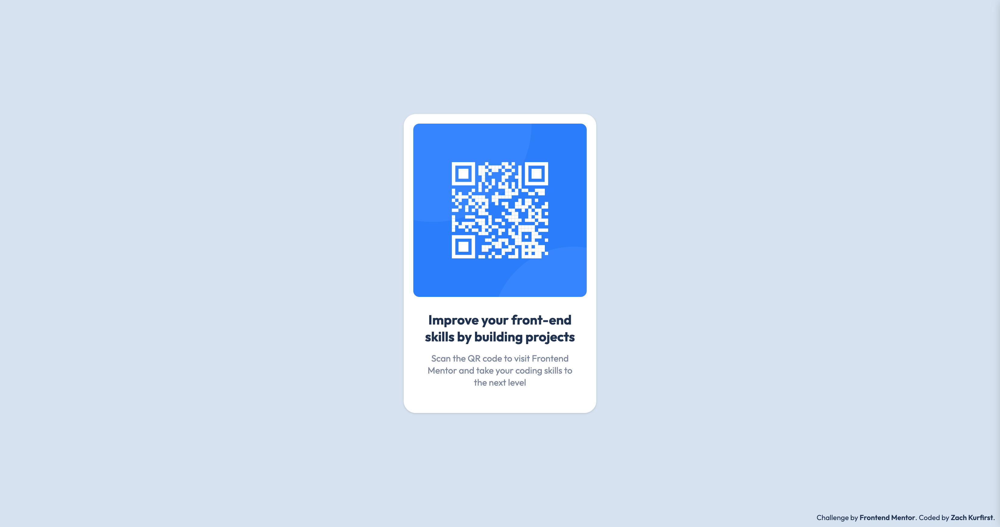

# QR Code Component

Hello there! Welcome to my solution to the [QR code component challenge on Frontend Mentor](https://www.frontendmentor.io/challenges/qr-code-component-iux_sIO_H). 

## Table of contents

- [Overview](#overview)
  - [Screenshot](#screenshot)
  - [Links](#links)
- [My process](#my-process)
  - [Built with](#built-with)
  - [What I learned](#what-i-learned)
  - [Continued development](#continued-development)
  - [Useful resources](#useful-resources)
- [Author](#author)

## Overview

### Screenshot



### Links

- [View live site](https://zachkurfirst-qr-code-component.vercel.app/)
- [View solution on Frontend Mentor](https://www.frontendmentor.io/solutions/qr-code-component-styled-with-tailwind-nIetA07lcb)

## My process

### Built with

- Semantic HTML5 markup
- [Tailwind](https://tailwindcss.com/) - CSS framework
- [Figma](https://www.figma.com/) - Referenced designs
- [Vercel](https://vercel.com/) - Deployment

### What I learned

This was my first time coding based on a provided Figma file. I closely referenced both the `style-guide.md` and the Figma file to develop my solution. 

Also, I deployed with **Vercel** for the first time (I've previously used GitHub pages, Heroku, Netlify). I intentionally chose Vercel because I wanted to try something new and expand my familiarity with deployment solutions. I ran into a `404: NOT FOUND` error, but then after a bit of troubleshooting realized I had to restructure my folders so that the root directory was set to `src`, which contained both the `index.html` and images.


I styled with **Tailwind CSS**, and made use of the arbitrary value functionality in order to be able to properly replicate the Figma sizing.

```html
    <main
      class="flex flex-col items-center h-[497px] rounded-[20px] bg-white drop-shadow">
      ...
      </main>
```
### Continued development

I'd like to continue working on solutions that derive from Figma designs so I can become even more comfortable with adapting from this design software. Especially when it comes to setting accurate values for margin/padding.

### Useful resources

- [Tailwind CSS Documentation](https://tailwindcss.com/docs/installation)
- [Vercel Deployment Documentation](https://vercel.com/docs/deployments/overview)
- [Using HTML landmark roles to improve accessibility](https://developer.mozilla.org/en-US/blog/aria-accessibility-html-landmark-roles/)

## Author

- Website - [Zach Kurfirst](https://zachkurfirst.com)
- Frontend Mentor - [@zachkurfirst](https://www.frontendmentor.io/profile/zachkurfirst)
